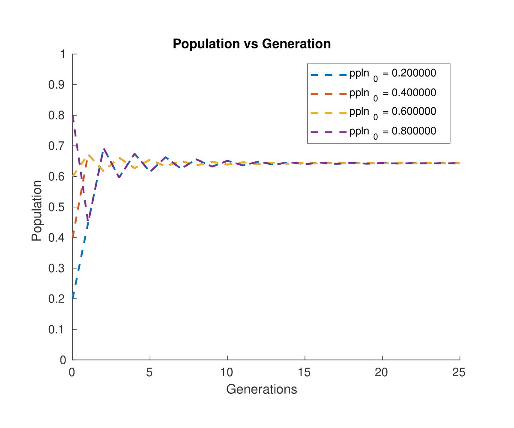

# Visual analysis of logistic maps

Used MATLAB R2022a-academic use to study and visualise:
* low dimensional chaos
* period doubling

in non-linear systems specifically logistic map.

Report explaining the logistic map can be found [here](https://github.com/dnshkmr7/visual-analysis-nld/blob/main/EP3227_Project_Report.pdf).

# Usage

## GrowthRate.m

User can't vary the initial population in this program, look at Population.m for the before mentioned task. User has the choice to construct a single plot or multiple plot. Enter appropriate choice and proceed to enter proper growth-rate parameters to get the desired plot.

 &nbsp;&nbsp;&nbsp;&nbsp;

## Population.m

User can't have multiple plots of growth-rate parameters in this program, look at GrowthRate.m for the before mentioned task. User has the choice to construct a single plot or multiple plot. Enter appropriate choice and proceed to enter proper initial population parameters to get the desired plot.

 &nbsp;&nbsp;&nbsp;&nbsp;

## Bifurcation.m

This constructs the bifurcation diagram of logistic map, there are no input prompts in this program. User needs to manually change the constants used in the code and run it to get desired plot.

 

# References

[1] Robert M. May. Simple mathematical models with very complicated dynamics. Nature, 261(5560):459–467, jun 1976.

[2] John H. Mathews and Kurtis K. Fink. Numerical Methods Using Matlab (4th Edition). Pearson, 4 edition, January 2004.

[3] D. Muller, J. Hyman . This equation will change how you see the world (the logistic map).https://www.youtube.com/watch?v=ovJcsL7vyrk.

[4] Geoff Boeing. Visual analysis of nonlinear dynamical systems: Chaos, fractals, self-similarity and the limits of prediction. Systems, 4(4), 2016.

[5] P. Nathan. Logistic map zoom at the boundary between order and chaos. https://www.youtube.com/watch?v=rrqiYHuNnbo. 

[6] A. Libchaber, C. Laroche, and Stephan Fauve. Period doubling cascade in mercury, a quantitative measurement. 43, 04 1982.

[7] Daniel W. Crevier and Markus Meister. Synchronous period doubling in flicker vision of salamander and man. Journal of neurophysiology, 79 4:1869–78, 1998.

[8] Bing Jia, Hua-Guang Gu, Li Li, and Xiaoyan Zhao. Dynamics of perioddoubling bifurcation to chaosin the spontaneous neural firing patterns. Cognitive neurodynamics, 6:89–106, 02 2012.

[9] Dante Chialvo, Robert Gilmour, and Jose Jalife. Low dimensional chaos in cardiac tissue. Nature, 343:653–7, 03 1990.

[10] Steven H. Strogatz. Nonlinear Dynamics and Chaos: With Applications to Physics, Biology, Chemistry and Engineering. Westview Press, 2000.
